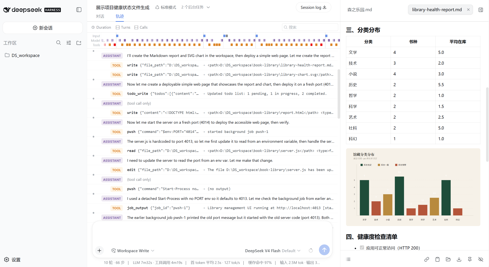
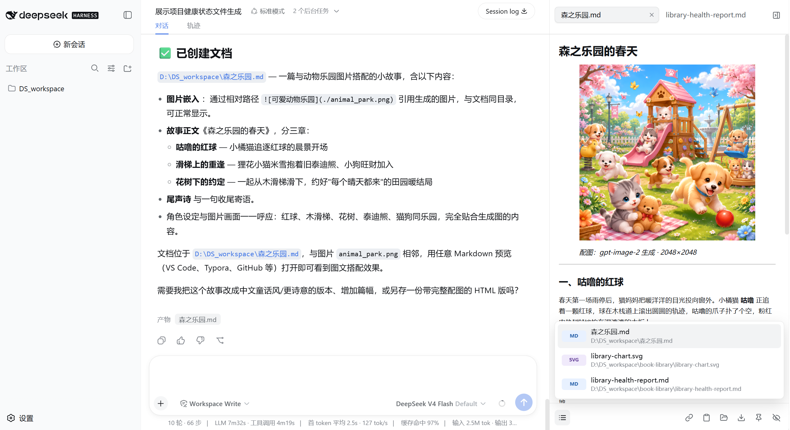

# DSH Right Sidebar

[中文](README.md) | English

DSH Right Sidebar is a native output workspace for
[DeepSeek Harness](https://github.com/deepseek-ai/deepseek-harness). It keeps the reports,
diagrams, images, data, and documents generated in a session beside the conversation instead
of scattering them across the workspace and tool history.



## Purpose

Output Dock is not a file manager, and it does not surface every file in a project. It keeps
only results a person can read, inspect, download, or use. Source code, configuration,
dependencies, and HTML source files remain the responsibility of the DSH workspace.

- Permanent right-edge entry that can open automatically, collapse, and restore manually
- Session-aware outputs, tab order, and closed-tab state
- Automatic refresh when the agent updates an output at the same path
- Closeable, draggable stacked tabs that retain readable names in a narrow sidebar
- A footer catalog that reopens closed outputs and scrolls independently after seven entries
- Direct, rendered Markdown editing with silent save after typing stops
- Copy path or content, download, reveal the containing directory, pin, or hide an output

## Preview Coverage

| Category | Supported now |
| --- | --- |
| Automatic outputs | Markdown, MDX, PDF, SVG, PNG, JPEG, WebP, GIF, AVIF, and BMP |
| On-demand outputs | TXT, JSON, JSONL, CSV, and TSV; shown only when the agent explicitly mentions the file path or name |
| Not displayed | Source, HTML/HTM, configuration, logs, YAML, TOML, XML, INI, CONF, and other project-internal files |

- JSON/JSONL: collapsible tree, search, expand/collapse all, formatted raw view, and invalid-line reporting
- CSV/TSV: quoted and multiline fields, filtering, numeric/text sorting, pagination, and resizable columns
- TXT: line numbers, full-text search, match count, wrapping, and 250-line pages for bounded DOM size
- Image/SVG: fit, actual size, zoom, drag-to-pan, dimensions, and a transparency checkerboard
- PDF: the browser's built-in PDF reader with refresh and external-open controls

HTML files are project source. A deployed website should instead be provided by the agent as an
accessible URL in the conversation. This keeps a frontend or full-stack project with many `js`,
`ts`, `css`, and configuration files from drowning out its actual deliverables.



## Use

1. Ask DSH to generate a report, diagram, image, PDF, or data file.
2. Rich outputs such as Markdown, PDF, SVG, and images automatically open the sidebar with the newest output selected.
3. Data files such as TXT, JSON, and CSV enter the output list only when the agent explicitly mentions them, and they do not replace the active rich preview.
4. Switch between outputs through tabs; reopen a closed item from the footer catalog.
5. Use "Reveal directory" when you need the source or project files in the DSH workspace.

## Install

DSH Right Sidebar requires a DSH Web build that exposes the session-scoped `details.overlay` slot
and named details-surface APIs.

```sh
git clone https://github.com/Limitinfinitude/DSH-Right-Sidebar.git
cd DSH-Right-Sidebar
npm install
npm run build
dsh plugin --profile web add .
```

Refresh the DSH Web session after installation.

## Performance and Security

The dock does not poll files or ports while idle. Output content is fetched only after selection,
and complex previews initialize on demand. JSON search traverses the data once, tables are capped at
10,000 rows, and TXT rendering is paginated. The browser bundle is approximately `184 KB gzip`.

Files inside a workspace are path-validated. Agent-produced outputs outside registered workspaces
can be accessed temporarily after same-origin authorization from DSH. Up to 256 authorized external
roots are retained, and each expires after six hours. Markdown and SVG are sanitized before rendering,
binary files are read-only, and HTML/HTM source is never embedded in the dock.

## Development

```sh
npm test -- --run
npm run typecheck
npm run build
```

## License

[MIT](LICENSE)
