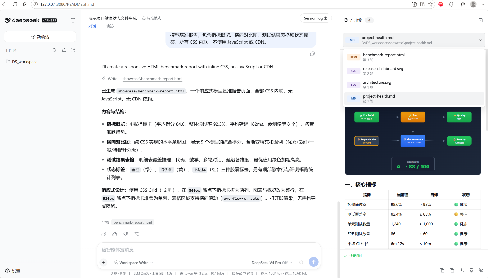
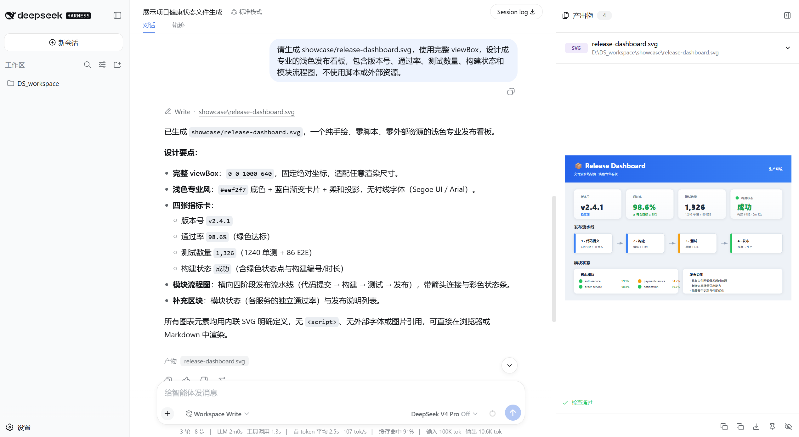

# Output Dock

[English](README.md) | 中文

为 DeepSeek Harness 打造的原生输出侧边栏。Agent 生成的文档、图表、图片、
页面和代码会留在会话旁，并在创建完成时直接打开。



## 概览

Output Dock 打通了“生成文件”和“查看结果”之间的断点。最新的有效产物会直接
显示在 DSH 可拖动缩放的原生右栏中，同时每个已生成文件仍保留在当前会话的列表里。

面板跟随 DSH 的主题和语言，需要查看工具详情时会交还右栏，也可以手动收起并从
右侧边缘恢复。

## 主要能力

- 自动选择并渲染最新产物
- 打开历史会话时重新构建该会话的输出列表
- 无需离开对话即可切换文件
- 支持复制路径、复制内容、下载、置顶和隐藏
- 在本地检查 Markdown 链接、SVG 结构、HTML 解析和图片加载
- 通过 `viewBox` 归一化与安全资源重写适配固定尺寸 SVG
- 在窄屏使用全高抽屉，不产生横向溢出

## 可视化输出

Markdown、SVG、HTML、PDF 和图片都可以在侧边栏内预览。相对资源会以产物文件
自身为基准解析，不会因为经过插件路由而失效。



## 安装

Output Dock 当前要求 DSH Web 提供会话级 `details.overlay` 插槽和具名详情栏 API。

```sh
git clone https://github.com/Limitinfinitude/DSH-Output-Dock.git
cd DSH-Output-Dock
npm install
npm run build
dsh plugin --profile web add .
```

安装后刷新 DSH Web 会话。

## 使用

1. 让 DSH 创建文档、图表、图片、页面或源码文件。
2. Output Dock 会在原生右栏中自动打开最新预览。
3. 使用文件选择器查看当前会话之前生成的产物。
4. 使用底部控件复制、下载、置顶或隐藏条目。

## 支持格式

| 类别 | 格式 |
|---|---|
| 文档 | Markdown、MDX、PDF |
| 视觉内容 | SVG、PNG、JPEG、WebP、GIF、AVIF、BMP |
| Web | HTML、HTM |
| 文本与代码 | 常见源码、配置、数据和纯文本扩展名 |

## 工作原理

Node 侧提供限定在工作区内的只读文件路由；客户端从修改工具记录中派生产物路径，
聚合成会话级视图，并把查看器注册到 DSH 原生详情栏。所有预览内容都会在渲染前
经过净化，质量检查完全由确定性规则完成，不调用模型。

## 开发

```sh
npm test -- --run
npm run typecheck
npm run build
```

## 当前限制

- 文件读取范围限定在启动工作区和 DSH 已注册工作区内。
- HTML 使用禁用脚本的沙箱预览。
- 置顶和隐藏偏好保存在当前浏览器；会话输出历史从日志重新构建。
- 当前版本尚未嵌入已部署的开发服务器，只预览项目生成的文件。

## 许可证

[MIT](LICENSE)
